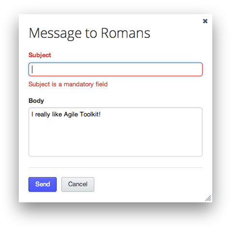

Agile Toolkit - Web UI Toolkit
====
Agile Toolkit is a Web UI framework and collection of usable widgets. It allows you to develop rich web applications by writing only PHP code. Agile Toolkit is inspired by Desktop GUI Toolkits and is a fully-object oriented development environment.

 * Homepage: http://agiletoolkit.org
 * Forums: http://forum.agiletoolkit.org
 * Docs: http://book.agiletoolkit.org

Overview
----
Agile Toolkit has introduced three new principles in web development:

 * A Complete UI solution for PHP developers
 * Unique integration between jQuery events and chains and PHP
 * Innovative Object Relational Manager with support for joins, sub-selects and expression abstraction.

All the features are delivered in a unique close-coupled environment - Similarly to Cocoa or Qt - all objects of Agile Toolkit are based off one common ancestor and are constructed under the guidance of the top-level Application object.

Installing
----
To start a new web application in Agile Toolkit, download a bundle from http://agiletoolkit.org/ and follow instructions.
Alternatively, if you are a very hardcore developer, add the following code inside your `composer.json` file:

    "require": {
        "atk4/atk4": "4.3.*@dev"
    }

Example
----
To help you understand some key principles of Agile Toolkit, copy the following example into `page/index.php` and place inside the init() method.

Source:

    $form = $this->add('Form');
    $form->addField('line', 'subject')->validateNotNull();
    $form->addField('password','password');
    $form->addSubmit();
    
    if ($form->isSubmitted()) {
        $this->js()->univ()
            ->dialogOK('Hello World','Subject: '.$form['subject'])
            ->execute();
    }

Congratulations. You have now created a fully AJAX / PHP form, fully protected from SQL / HTML / JS injection, based on jQuery UI theme and Bootstrap-compatible 12-column flexible grid system.

## License

Agile Toolkit is distributed under MIT License.

** Your support will ensure the longevity of Agile Toolkit **

